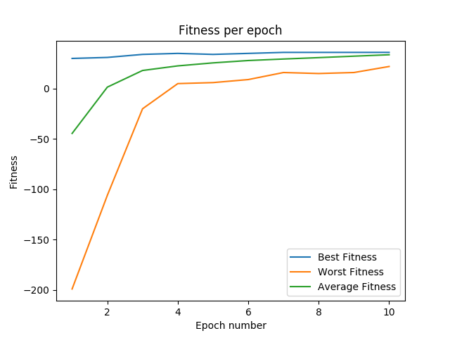

# CC5114
Segunda tarea del curso Redes Neuronales y Programación genética.

###Tarea 2
Los problemas para encontrar un número binario y encontrar una palabra/frase se encuentran
como comentarios al final del archivo ga_machine.py. Para ejecutarlos, es necesario cambiar el 
parámetro de la condición de término en la función run, dentro de la clase GA, por "i" en vez de 
"self.best_fitness".

Como problema alternativo se eligió "Unbound Knapsack", para ejecutar el algoritmo y graficar
el número de iteraciones, que fue lo que se eligió para determinar la mejor tasa de mutación
 y número de población, en función de la tasa de mutación y el número de individuos de la 
 población (mapa de calor) se debe cambiar el parámetro de la condición de término de la función 
 run, por "self.best_finess". Además es necesario comentar los problemas escritos en el mismo 
 archivo ga_machine.py. El archivo es hotmap.py.

Para graficar el fitness en función del número de iteraciones se debe ejecutar el archivo
fitness_plot.py bajo las mismas condiciones mencionadas en el primer párrafo.

Los resultados obtenidos son los siguientes:

Fitness por generación:

Mapa de calor:

Cabe mencionar que para graficar el mapa de calor no fue posible llegar a una solución en tiempo
razonable con todas las combinaciones posibles, por lo que se estableció un número de iteraciones
máximo de 100 como condición de término si es que la solución no era encontrada. Así, se observan
grandes diferencias en el número de iteraciones entre las tasas de mutación muy pequeñas y muy 
altas. Para este problema en particular no se ve la variación con respecto a la variable población.
Además, no se presentan problemas con tasas de mutación muy altas, pero es probable que para
problemas más complejos no sea tan sencillo abordar la solucion a partir de altas tasas,
considerando que es posible que se lleguen a mutar individuos con un buen fitness, dejándolos 
con un fitness peor al que se tenía anteriormente.

Si no es posible ver la imagen del mapa de calor, por favor visualizar la imagen hotmap.png
directamente.