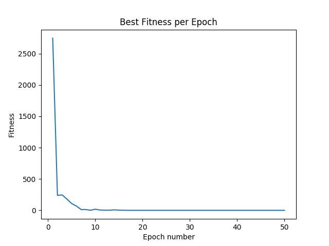
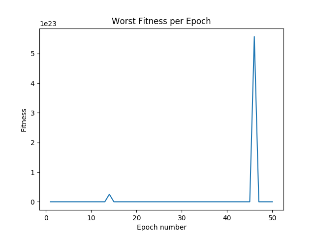
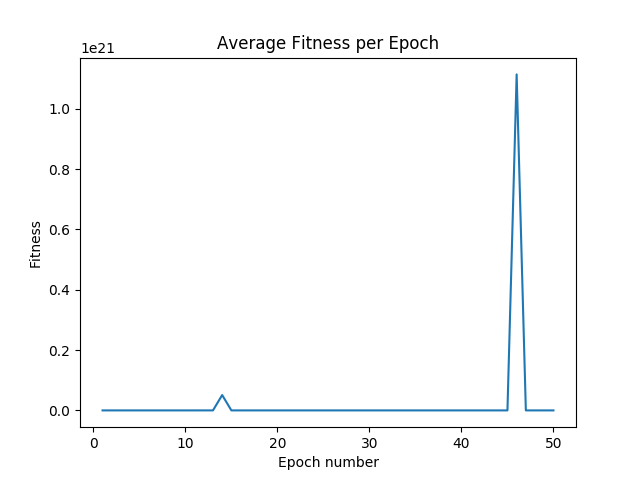
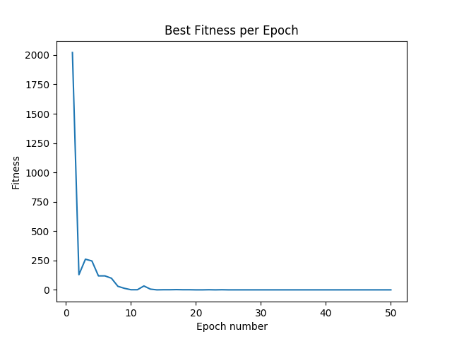
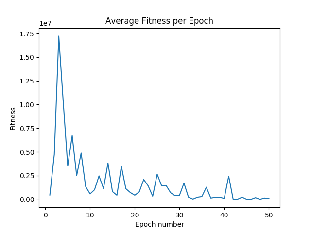
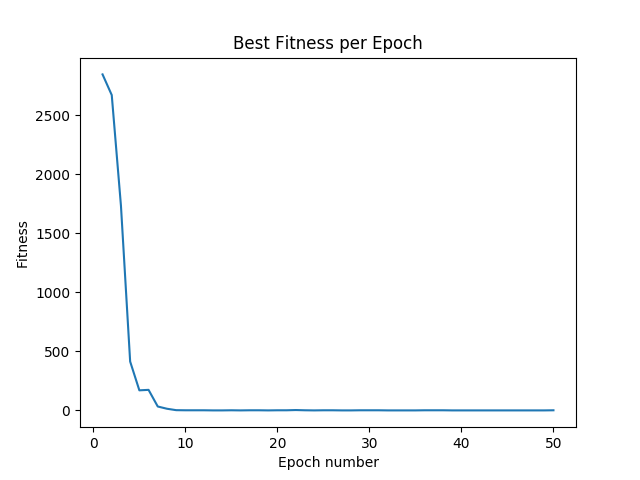
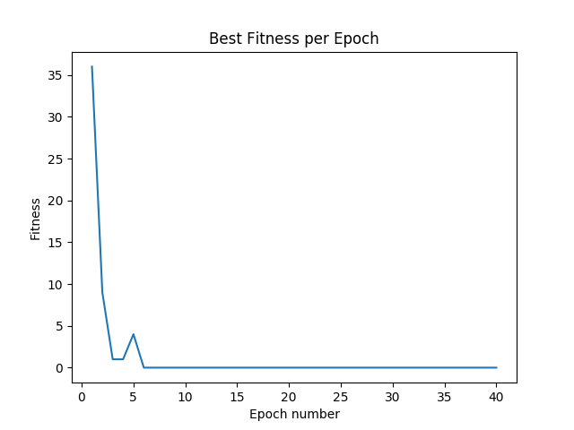
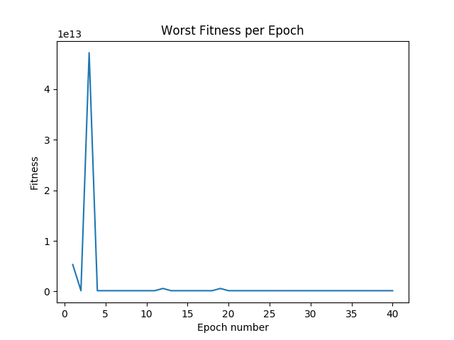
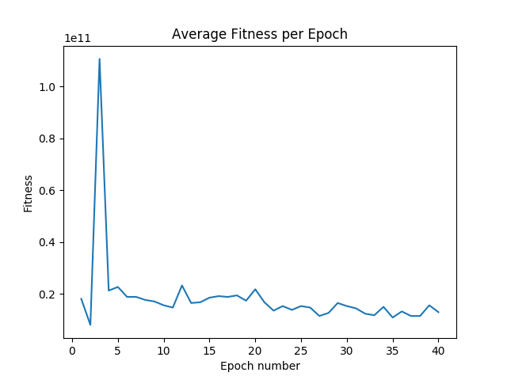
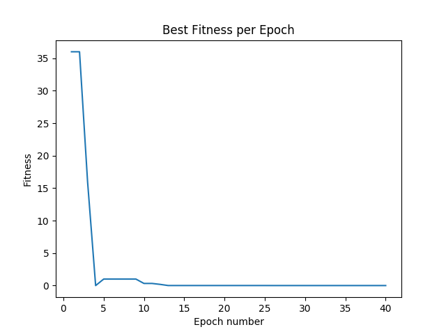

### Tarea 3: Programación Genética

### Código del algoritmo
El generador de árboles aleatorios (cuyo nombre fue cambiado a *abstract_syntax_tree.py* por problemas 
con una librería ya existente del mismo nombre) y la librería de árboles se obtuvieron del material 
docente del curso. El código del algoritmo en sí se encuentra en el archivo *gp_machine.py*, con la 
documentación correspondiente. La tarea fue implementada en lenguaje Python 3.6. Cabe mencionar que 
la implementación sigue las sugerencias del enunciado.

### Encontrar número

#### Sin límite de repeticiones
El código de este ejercicio se encuentra en el archivo *find_number.py*, donde además se generan los
gráficos de curvas de evolución de fitness (mejor, promedio y peor) para crossover 
(*best_fitness_1.png*, *average_fitness_1.png* y *worst_fitness_1.png* respectivamente) y mutación.
Los gráficos para la mutación no pudieron ser generados, ya que el código para crearlos se incluyó
posteriormente y luego de numerosos intentos el programa no lograba terminar su ejecución por tope
de memoria. 

La tasa de mutación y población utilizados para este y los ejercicios que continuan es de 0.5 y 
500 individuos respectivamente.

Luego de alguna pruebas se consideró que el número de iteraciones indicado para este ejercicio es de 50.

Figura 1                           |  Figura 2                      
:-------------------------:|:-------------------------:
  |  

Figura 3 |
:-------------------------:|
 |

#### Fitness
Para castigar a los árboles que crecen demasiado, a la diferencia entre el número esperado y el número
obtenido en la evaluación de cada árbol se sumó una proporción entre el tamaño del árbol obtenido y 
un valor lo suficientemente grande, tal que los tamaños reales de los árboles no lo alcanzaran 
fácilmente, de manera que el castigo no fuese tan severo como para que adquiriera mayor importancia que
la diferencia entre los números. Luego de algunas pruebas experimentales, se consideró 10000 como un
valor razonable. Para medir los tamaños de los árboles se agregó el método *get_size* a la clase Node del 
archivo *arboles.py*. El archivo para correr el programa y generar los gráficos de la misma forma que en
la sección anterior y las que vienen a continuación se llama *find_number_quick.py*.

Adjuntando los gráficos de las curvas de evolución de fitness utilizando crossover:

Figura 4                           |  Figura 5                      
:-------------------------:|:-------------------------:
  |  

Figura 6 |
:-------------------------:|
 |

Adjuntando los gráficos de las curvas de evolución de fitness utilizando mutación:

Figura 7                           |  Figura 8                      
:-------------------------:|:-------------------------:
  |  

Figura 9 |
:-------------------------:|
 |

#### Sin repetición
Para evitar la repetición de números se modificó la función de fitness anterior, agregando un error basado
en la cantidad de duplicaciones. El archivo con la implementación y generación de gráficos, al igual que en
los ejercicios anteriores, se llama *find_number_without_reps.py*. A continuación se adjuntan los
resultados con crossover y mutación, en ese orden.

Figura 10                           |  Figura 11                      
:-------------------------:|:-------------------------:
  |  

Figura 12 |
:-------------------------:|
 |

Figura 13                           |  Figura 14                      
:-------------------------:|:-------------------------:
  |  

Figura 15 |
:-------------------------:|
 |

### Modificación para soporte de variables
Dentro del archivo *arboles.py*, en el método *eval* de la clase *Node*, se agregó un argumento de tipo 
diccionario que recibe las variables con los valores que se le asignarán para evaluar la función. Los 
terminales que no corresponden a números, se les debe otorgar como llave y valor el mismo número. 
Asimismo, se modificó la función *eval* de la clase *TerminalNode*.

Para el ejercicio en el que se debe encontrar número, y sus variantes, simplemente se agregó el 
diccionario con el método mencionado en el párrafo anterior: dado que no hay variables sólo se
añadieron números.

### Symbolic Regression
El archivo donde se encuentra el código del ejercicio se llama *symbolic_regression.py*. Aquí se
consideró que 40 era un número de iteraciones lo suficientemente alto como para lograr encontrar
una solución. Las curvas de evolución de fitness para crossover y mutación se adjuntan a continuación en
el orden mencionado.

Figura 16                           |  Figura 17                      
:-------------------------:|:-------------------------:
  |  

Figura 18 |
:-------------------------:|
 |

Figura 19                           |  Figura 20                      
:-------------------------:|:-------------------------:
  |  

Figura 21 |
:-------------------------:|
 |

### Implementación del nodo División
#### División por cero
Para evitar dividir por cero, en primer lugar se capturó la excepción *ZeroDivisionError* al correr 
el algoritmo de programación genética, dentro del archivo *symbolic_regression_with_div.py*. A su vez,
se debió capturar la misma excepción al evaluar la expresión contenida en el árbol en cada punto del
rango [-100, 100], dentro del método *fitness_4* del mismo archivo. Si la expresión evaluada contiene
una división por cero, entonces inmediatamente se castiga a la función de fitness del árbol asignándole 
el máximo valor de tipo int disponible (*sys.maxsize*), ya que se está minimizando. Este número se eligió 
por simplicidad, pero bastaba un valor lo suficientemente grande e inalcanzable sólo para la función 
de fitness. Por otro lado, el castigo a la función de fitness pudo haber sido menos severo, pero este
tipo de árboles requerían considerarse inválidos.

El número de iteraciones se mantuvo igual al ejercicio anterior (symbolic regression sin división).

Los resultados de las curvas de fitness para crossover y mutación son los siguientes:

Figura 22                           |  Figura 23                      
:-------------------------:|:-------------------------:
  |  

Figura 24 |
:-------------------------:|
 |

Figura 25                           |  Figura 26                      
:-------------------------:|:-------------------------:
  |  

Figura 27 |
:-------------------------:|
 |

### Heatmap de configuraciones

El heatmap de configuraciones se realizó en base al ejercicio Symbolic Regression (sin división).
El código para generarlo se encuentra en el archivo *hotmap_sr.py*.
En este caso un algoritmo se considera mejor que otro si necesita una menor cantidad de iteraciones
para encontrar la solución. El número máximo de número de iteraciones es de 30. La primera vez
se realizó con un número máximo de 50 iteraciones, pero la demora fue de aproximadamente 9 horas. En
un intento por reducir el tiempo de performance se disminuyó a un tope de 30 iteraciones. Con esta
cantidad sólo se pudo disminuir el tiempo a 8 horas aproximadamente.

**Nota importante: Para generar el heatmap es necesario modificar la variable de la condición de 
término dentro de la función *run* de la clase que define a una máquina de programación genética 
(*gp_machine.py*). Actualmente se encuentra la variable i que representa el número de iteraciones.
Con esta variable es posible correr todo el código menos la generación del heatmap. Para hacer esto
último debería colocarse self.best_fitness en vez. De todas formas esto se encuentra comentado
al interior del código.** 

Figura 28: Heatmap de configuraciones |
:-------------------------:|
 |