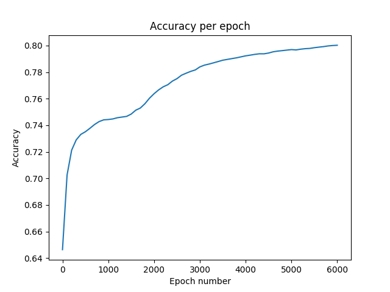

# CC5114
Tareas del curso Redes Neuronales y Programación genética.

###Tarea 1
Para procesar los datos correr el siguiente comando en la terminal:
```python3 read_data.py```

Para correr la red y generar las predicciones junto con las métricas correr el siguiente
comando en la terminal:
```python3 NeuralNetwork.py```

Para esta tarea se utilizó el dataset "Census Income" 
(https://archive.ics.uci.edu/ml/datasets/Census+Income), 
del cual se pretende predecir si una persona gana más
o menos de 50000 dólares anuales. 
Básicamente consiste de 14 atributos, los cuales se 
describen en la página de referencia dada. De estos, se
descartó un atributo: *education*, ya que *education-num*
describe lo mismo, pero de forma numérica, que es lo
que nos interesa por la posterior normalización.

El código fue escrito en lenguaje Python versión 3.6. Las
librerías utilizadas para manipular los datos fueron Numpy 
1.15 y Pandas 0.23. Es importante utilizar estas versiones
para correr el código puesto que en versiones superiores 
algunas funciones están deprecadas.

La normalización, 1-hot encoding y separación de los datos 
en set de entrenamiento y de testing se realizaron
en el archivo read_data.py. Es por esto que para generar
una nueva separación debe correrse este código primero.

Por otro lado, en el archivo NeuralNetwork.py está
implementada la red, donde además se realizan las
mediciones correspondientes al entrenamiento y predicción.
Esta red neuronal corresponde a la implementada por el 
profesor, a la cual se le realizaron algunas modificaciones
para su correcto funcionamiento con más de un output label.
Aquí también se implementan las funciones de activación, pero
sólo por completitud: tanh(x) y step(x) pueden llamarse
inmediatamente desde la librería Numpy. Las derivadas no se
implementaron considerando que se escriben directamente en 
el código.

La neurona se implementó en el archivo neuron.py.

La implementación de la red no considera como parámetros el número de capas
internas. Es decir, sólo se entrena con una capa interna.

Los archivos de los datos extraídos se llaman adultdata.txt y adulttest.txt. Se
eliminaron las filas que tenían valores nulos. Así, quedaron 45222 filas en total,
de las cuales se extrajo un 20% para el conjunto de testing. Cabe mencionar que
en la separación de datos no se equiparó la cantidad de las dos output labels, lo
que hubiese podido variar la performance de la red. Quedó pendiente evaluar esto.

En general, el rendimiento de la red se considera buena. Además, al imprimir la matriz de
confusión luego de la predicción, alrededor del 80% de los datos fueron
correctamente predichos. A continuación se adjunta la matriz de confusión,
la tasa de error por época y el accuracy por época:

[[6219 526]\
 [1278 1022]]

 
 
 
 El output corresponde a una sola clase, pero al procesarla con 1-hot encoding corresponde
 a dos labels.
 En un principio, la predicción fue hecha en base a un threshold que clasificaba 
 un output label inmediatamente como un valor del 1-hot encoding. Esto dio errores
 de predicción, ya que al clasificarlos independientemente y no considerar los labels 
 como una sola clase daba origen a valores del tipo "[0 0]", que no tienen ninguna
 relación con la codificación mencionada. Finalmente, se eliminó la clasificación
 mediante un threshold y simplemente se dejaron los valores calculados por la red.
 Una vez hecha la predicción, se clasificaron los valores para devolverlos a la etiqueta
 que se hace según 1-hot encoding. Esto se hizo creando una matriz de ceros, y
 seteando en 1 el mayor valor de ambos labels.

 Por último, es necesario mencionar que el número de iteraciones fue de 6000 debido a dos
 motivos. Por un lado el error era bajo según las mediciones comparado con otros datasets, como las compuertas
 lógicas, por ejemplo. Por otro lado el tiempo total de entrenamiento (de las 6000 iteraciones) fue de 145 segundos, lo cual 
 se considera lo suficientemente alto considerando el error entregado. 


